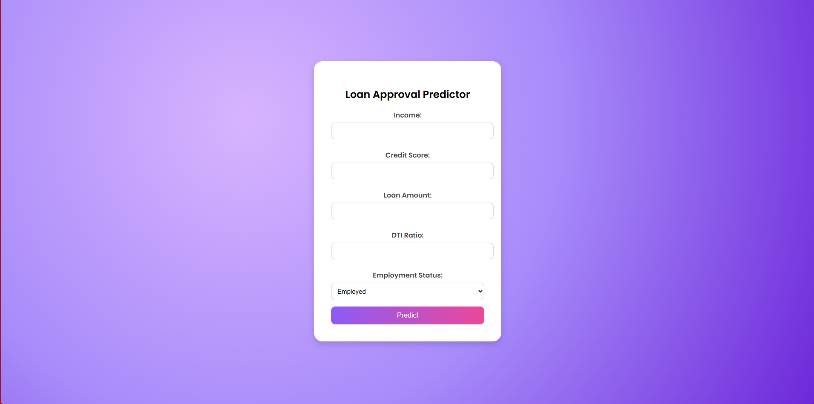
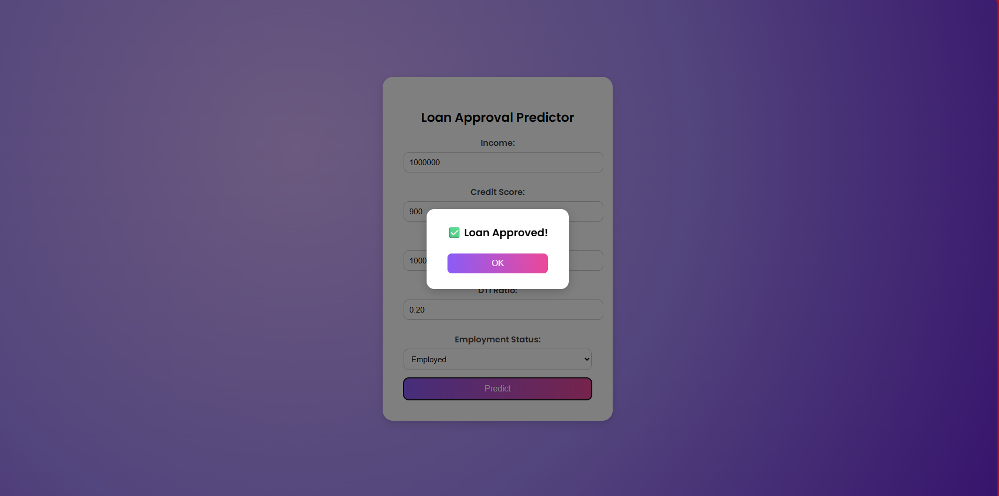
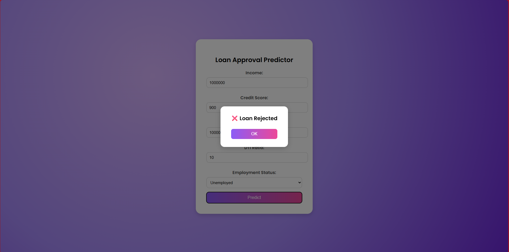

# 💰 Loan Approval Predictor

A simple **Flask-based web app** that predicts loan approval based on user inputs such as income, credit score, loan amount, and DTI ratio.

---

## 🚀 Features
- 🧾 Clean and user-friendly form interface  
- ⚡ Real-time popup for loan approval result  
- 🤖 Machine learning model integrated with Flask  
- 💻 Responsive, modern, and colorful UI design  

---

## 🖼️ Screenshots

| Home Page | Approved Popup | Rejected Popup |
|------------|----------------|----------------|
|  |  |  |

---

## ⚙️ Technologies Used
- **Python**
- **Flask**
- **HTML5 / CSS3**
- **scikit-learn**
- **pandas**

---

## 🧠 How It Works
The machine learning model is trained on `loan_data.csv`, which includes features such as:
- **Income**
- **Credit Score**
- **Loan Amount**
- **DTI Ratio**
- **Employment Status**

Based on these inputs, the model predicts whether a loan **will be approved or rejected**.

---

## 🧩 How to Run Locally

1. **Clone this repository**
   ```bash
   git clone https://github.com/shanntanu-k/Loan-Approval-Model.git
   cd Loan-Approval-Model

   Install dependencies

2. **Install dependencies**
   ```bash
    pip install -r requirements.txt

3. **Run the Flask app**
   ```bash
    python main.py
4. **Open in your browser**
   ```bash
     http://127.0.0.1:5000/
   
   
